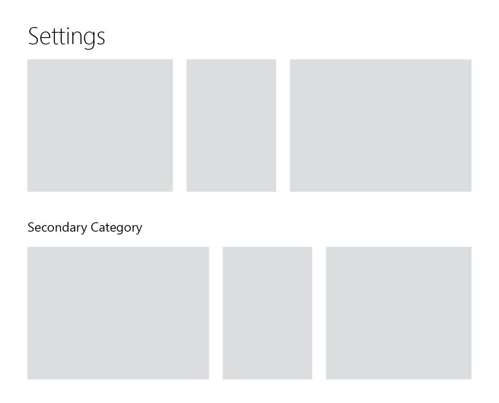

architus bot settings are dynamically rendered, consumed, and validated based off of a JSON schema as detailed below.

## Top-level format

At the highest level, the Settings schema is composed of an array of category definitions, each of which contain one or more settings cards:

```json
{
  "categories": [
    ...
  ]
}
```

The reasoning behind having a top-level organization scheme of the `category` is to support a view that looks something like the following mockup, where multiple vertical sections would be possible, enabling large collections of settings
to be effectively categorized.



### Category Object

###### Category Structure

| Field  | Type                                   | Description                                                                   |
| ------ | -------------------------------------- | ----------------------------------------------------------------------------- |
| title? | string                                 | If non-null, then this category will appear separate from the global category |
| cards  | array of [setting card](#card) objects | Child cards within the category                                               |
